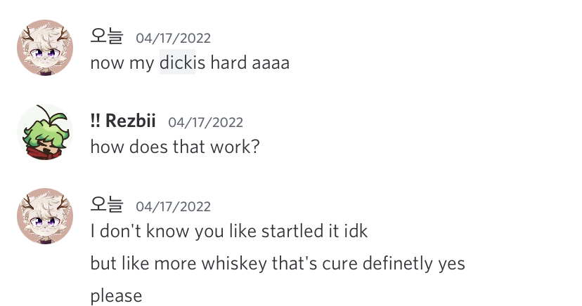
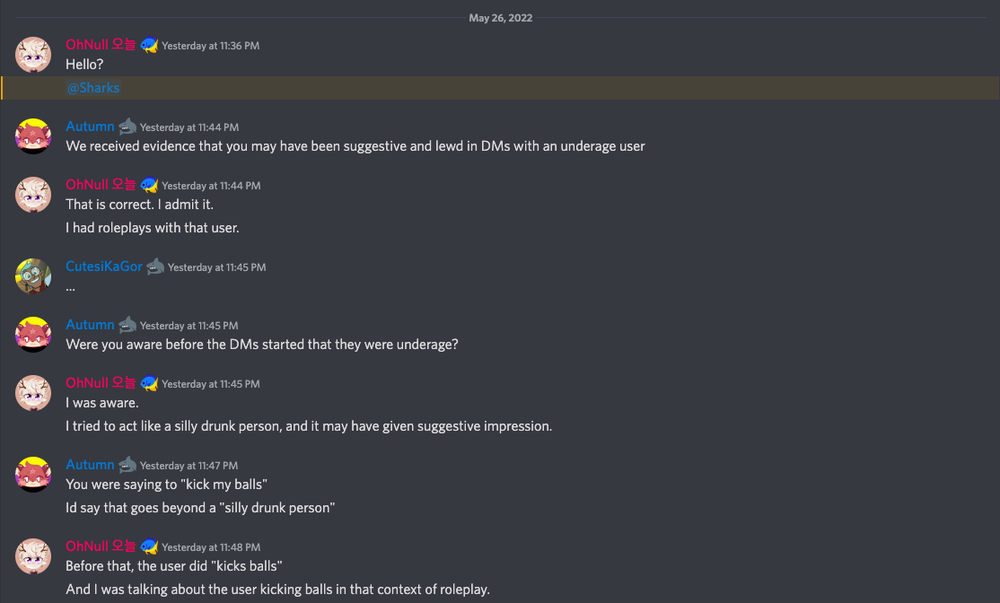
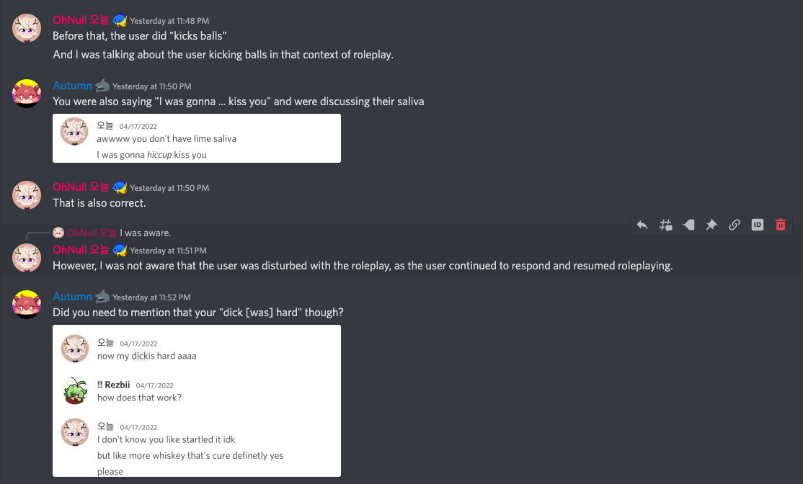
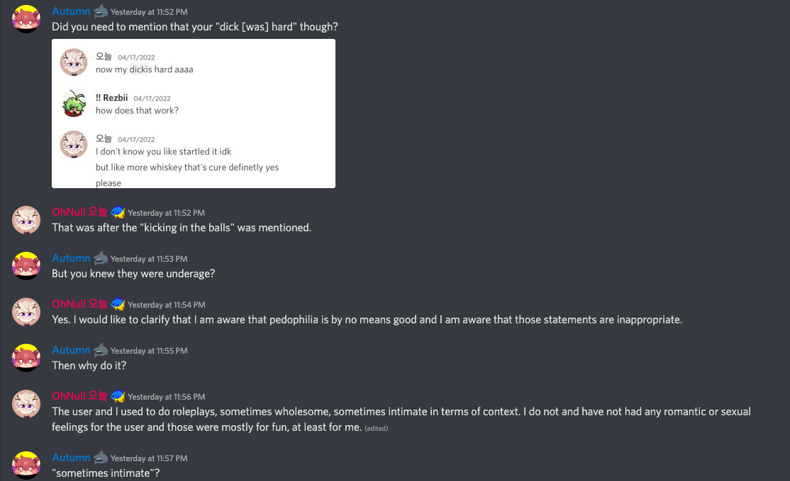
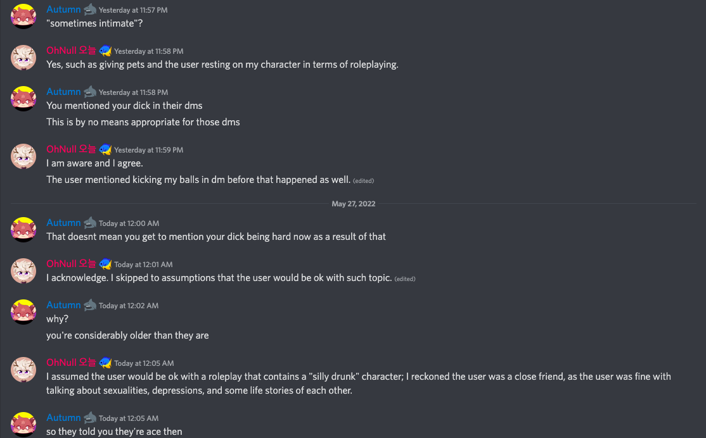
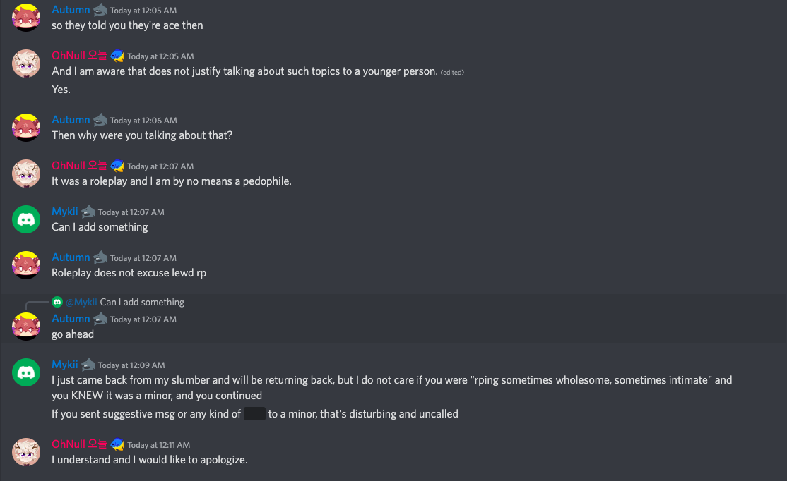
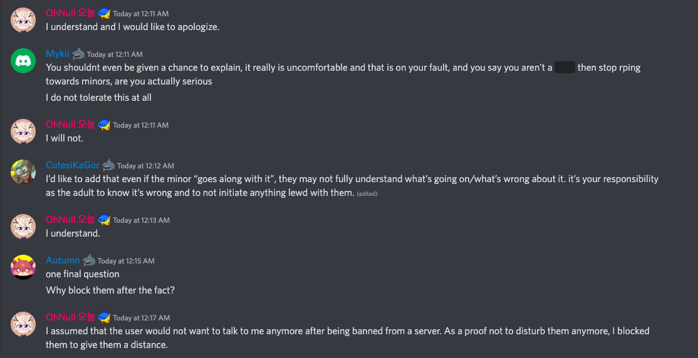
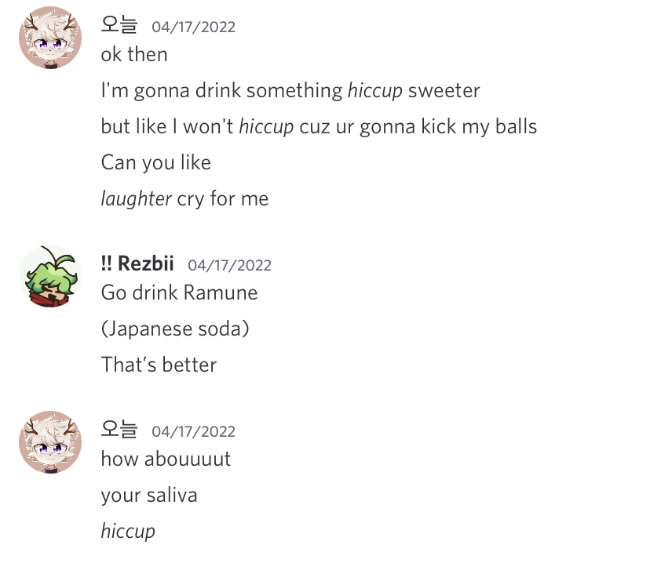
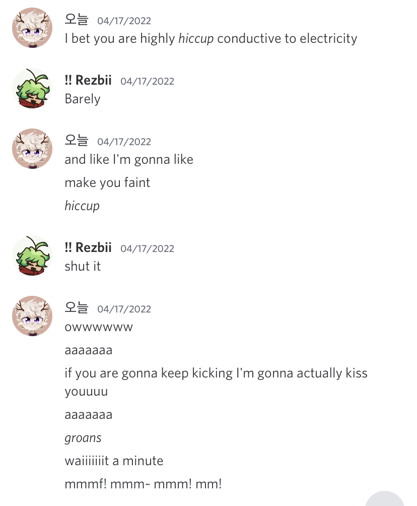

# Introduction

TIMES ARE IN UTC.\
This file is meant to be read as a markdown file. If possible, please read the file in such a program.

# USERS INVOLVED

| user ID            | Display name | Username and discriminator |
| :----------------: | :----------: | :------------------------: |
| 436965815036674079 | OhNull 오늘   | 오늘#7777                    |
| 440232487738671124 | Autumn       | Eclipse_Darkpaw#0320       |
| 716308243902758975 | CutesiKaGor  | corgsi05#0005              |
| 313897320762834945 | Mykii        | Mykii#2752                 |

# TEXT BASED LOGS

The following Text occured in [YonKaGor and MelloRange's server](https://discord.gg/39Ha2M9deB) in the suspended chats. 
The chat has been wiped, but screenshots were taken and documented below

---

___OhNull 오늘___ — `May 26 at 11:36 PM`\
Hello?

@Sharks

___Autumn___ — `May 26 at 11:44 PM`\
We received evidence that you may have been suggestive and lewd in DMs with an underage user

___OhNull 오늘___ — `May 26 at 11:44 PM`\
That is correct. I admit it.

I had roleplays with that user.

___CutesiKaGor___ — `May 26 at 11:45 PM`\
…

___Autumn___ — `May 26 at 11:45 PM`\
Were you aware before the DMs started that they were underage?

___OhNull 오늘___ — `May 26 at 11:45 PM`\
I was aware.

I tried to act like a silly drunk person, and it may have given suggestive impression.

___Autumn___ — `May 26 at 11:47 PM`\
You were saying to "kick my balls"

Id say that goes beyond a "silly drunk person"

___OhNull 오늘___ — `May 26 at 11:48 PM`\
Before that, the user did "kicks balls"

And I was talking about the user kicking balls in that context of roleplay.

___Autumn___ — `May 26 at 11:50 PM`\
You were also saying "I was gonna ... kiss you" and were discussing their saliva

[Original Image](https://cdn.discordapp.com/attachments/811097722013876255/979522449710411776/IMG_4991.png)

___OhNull 오늘___ — `May 26 at 11:50 PM`\
That is also correct.

___OhNull 오늘___ — `May 26 at 11:51 PM` - *Reply to ___OhNull 오늘___ "I was aware"*\
However, I was not aware that the user was disturbed with the roleplay, as the user continued to respond and resumed 
roleplaying.

___Autumn___ — `May 26 at 11:52 PM`\
Did you need to mention that your "dick [was] hard" though?

[Original 
Image](https://media.discordapp.net/attachments/811097722013876255/979522449370669127/IMG_4993.png?width=722&height=380)

___OhNull 오늘___ — `May 26 at 11:52 PM`\
That was after the "kicking in the balls" was mentioned.

___Autumn___ — `May 26 at 11:53 PM`\
But you knew they were underage?

___OhNull 오늘___ — `May 26 at 11:54 PM`\
Yes. I would like to clarify that I am aware that pedophilia is by no means good and I am aware that those statements 
are inappropriate.

___Autumn___ — `May 26 at 11:55 PM`\
Then why do it?

___OhNull 오늘___ — `May 26 at 11:56 PM` - *Edited*\
The user and I used to do roleplays, sometimes wholesome, sometimes intimate in terms of context. I do not and have not 
had any romantic or sexual feelings for the user and those were mostly for fun, at least for me.

___Autumn___ — `May 26 at 11:57 PM`\
"sometimes intimate"?

___OhNull 오늘___ — `May 26 at 11:58 PM`\
Yes, such as giving pets and the user resting on my character in terms of roleplaying.

___Autumn___ — `May 26 at 11:58 PM`\
You mentioned your dick in their dms

This is by no means appropriate for those dms

___OhNull 오늘___ — `May 26 at 11:59 PM`\
I am aware and I agree.

___OhNull 오늘___ — `May 26 at 11:59 PM` - *Edited*\
The user mentioned kicking my balls in dm before that happened as well. 

___Autumn___ — `May 27 at 12:00 AM`\
That doesnt mean you get to mention your dick being hard now as a result of that

___OhNull 오늘___ — `May 27 at 12:01 AM` - *Edited*\
I acknowledge. I skipped to assumptions that the user would be ok with such topic. 

___Autumn___ — `May 27 at 12:02 AM`\
why?

you're considerably older than they are

___OhNull 오늘___ — `May 27 at 12:05 AM`\
I assumed the user would be ok with a roleplay that contains a "silly drunk" character; I reckoned the user was a close friend, as the user was fine with talking about sexualities, depressions, and some life stories of each other.

___Autumn___ — `May 27 at 12:05 AM`\
so they told you they're ace then

***OhNull 오늘*** — `May 27 at 12:05 AM` - *Edited*\
And I am aware that does not justify talking about such topics to a younger person. 

Yes.

___Autumn___ — `May 27 at 12:06 AM`\
Then why were you talking about that?

___OhNull 오늘___ — `May 27 at 12:07 AM`\
It was a roleplay and I am by no means a pedophile.

___Mykii___ — `May 27 at 12:07 AM`\
Can I add something

___Autumn___ — `May 27 at 12:07 AM`\
Roleplay does not excuse lewd rp

___Autumn___ — `May 27 at 12:07 AM` - *Reply to ___Mykii___ "Can I add something"*\
go ahead

___Mykii___ — `May 27 at 12:09 AM`\
I just came back from my slumber and will be returning back, but I do not care if you were "rping sometimes wholesome, 
sometimes intimate" and you KNEW it was a minor, and you continued

If you sent suggestive msg or any kind of ||lewd|| to a minor, that's disturbing and uncalled

___OhNull 오늘___ — `May 27 at 12:11 AM`\
I understand and I would like to apologize.

___Mykii___ — `May 27 at 12:11 AM`\
You shouldnt even be given a chance to explain, it really is uncomfortable and that is on your fault, and you say you 
aren't a pedo then stop rping towards minors, are you actually serious

I do not tolerate this at all

___OhNull 오늘___ — `May 27 at 12:11 AM`\
I will not.

___CutesiKaGor___ — `May 27 at 12:12 AM` - *Edited*\
I’d like to add that even if the minor “goes along with it”, they may not fully understand what’s going on/what’s wrong 
about it. it’s your responsibility as the adult to know it’s wrong and to not initiate anything lewd with them. 

___OhNull 오늘___ — `May 27 at 12:13 AM`\
I understand.

___Autumn___ — `May 27 at 12:15 AM`\
one final question

Why block them after the fact?

___OhNull 오늘___ — `May 27 at 12:17 AM`\
I assumed that the user would not want to talk to me anymore after being banned from a server. As a proof not to disturb
them anymore, I blocked them to give them a distance.
---
# SCREENSHOTS
These are images to Confirm I'm not falsifying the Logs. All these images are included in the file.

## Suspension

## Evidence provided
/
[Original Source](https://cdn.discordapp.com/attachments/811097722013876255/979522448842166362/0CB4D1C0-0FDD-4B00-8FA6-7042698B8F8A.jpg)

/
[Original Source](https://cdn.discordapp.com/attachments/811097722013876255/979522449123180614/IMG_4994.png)

/
[Original Source](https://cdn.discordapp.com/attachments/811097722013876255/979522449370669127/IMG_4993.png)

/
[Original Source](https://cdn.discordapp.com/attachments/811097722013876255/979522449710411776/IMG_4991.png)
